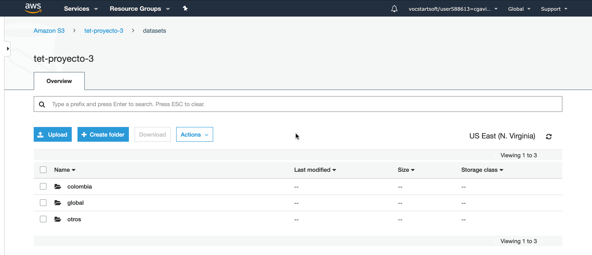

# TET Proyecto 3

## 1. Fuentes de Datos

Se descargaron los datasets que había en los enlaces proveídos. Estos se encuentran en el directorio [datasets](datasets).

## 2. Ingesta y Almacenamiento de Datos

La ingesta y almacenamiento de los datos a AWS S3 se hizo con los siguientes pasos:

1. Creamos un _bucket_ en AWS S3 como se observa en las imágenes.   
2. Creamos una carpeta _datasets_ donde subiremos los directorios con los correspondientes datasets.   
3. Subimos los datos a _datasets_ como se muestra a continuación. Damos click en datasets  y después en el botón **Upload**. En la interfaz que se muestra arrojamos nuestras fuentes de datos,  unda **Next** hasta que llegue a la siguiente pantalla y asegúrese de poner la configuración que se muestra,  ahora presionamos **Upload** y todo quedará listo  

## 3. Procesamiento: Análisis Exploratorio de Datos con PySpark

## 4. Visualización Básica de Datos

### 4.1. Situación a Nivel Mundial

### 4.2. Situación en Colombia

### 4.3. Colombia vs Mundo
