# TET Proyecto 3

El Jupyter Notebook en donde se desarrolló lo que se muestra a continuación se puede encontrar en [covidcs.ipynb](covidcs.ipynb).

## 1. Integrantes

- Santiago Arredondo Quintero
- Camilo Gaviria Castrillón

## 2. Fuentes de Datos

Se descargaron los datasets que había en los enlaces proveídos. Estos se encuentran en el directorio [datasets](datasets).

## 3. Ingesta y Almacenamiento de Datos

La ingesta y almacenamiento de los datos a AWS S3 se hizo con los siguientes pasos:

1. Creamos un _bucket_ en AWS S3 como se observa en las imágenes. 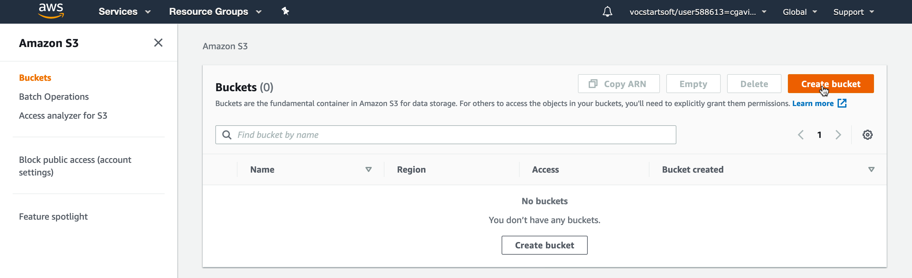  
2. Creamos una carpeta _datasets_ donde subiremos los directorios con los correspondientes datasets.   
3. Subimos los datos a _datasets_ como se muestra a continuación. Damos click en datasets  y después en el botón **Upload**. En la interfaz que se muestra arrojamos nuestras fuentes de datos,  unda **Next** hasta que llegue a la siguiente pantalla y asegúrese de poner la configuración que se muestra,  ahora presionamos **Upload** y todo quedará listo  

## 4. Procesamiento: Análisis Exploratorio de Datos con PySpark

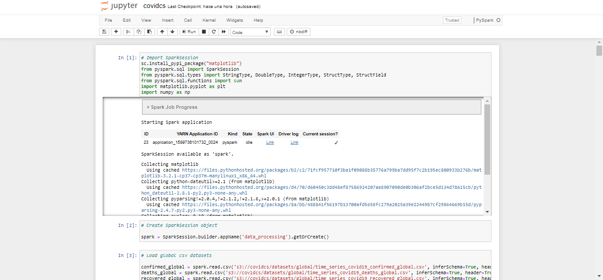  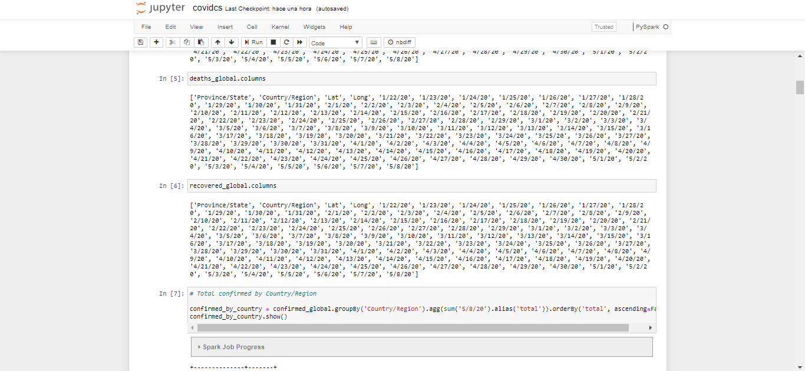 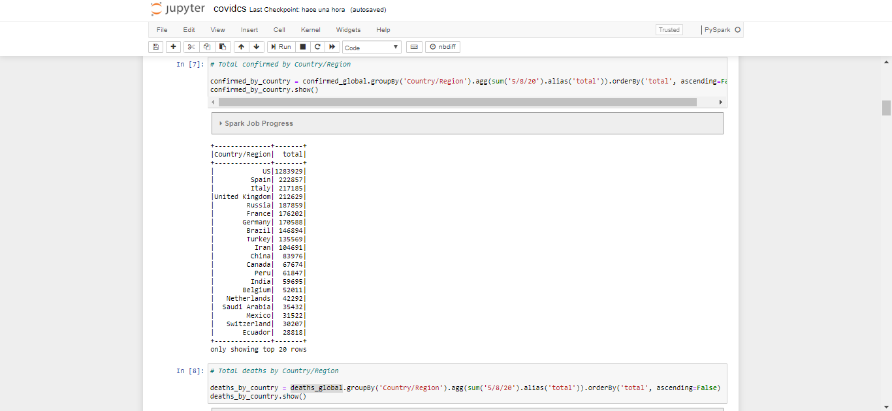    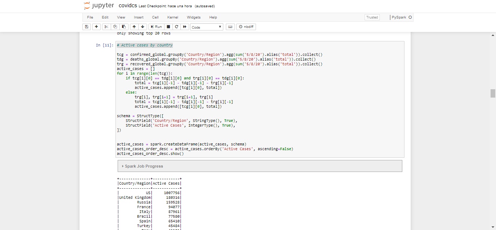  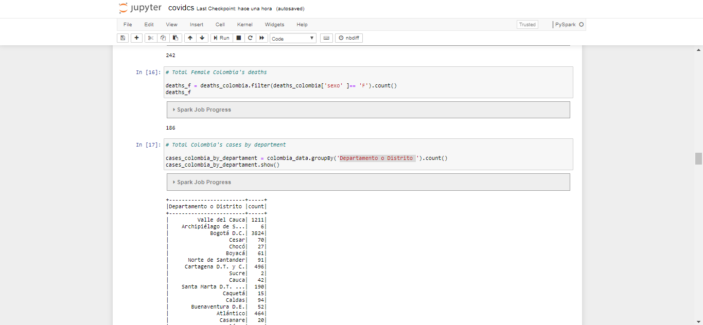 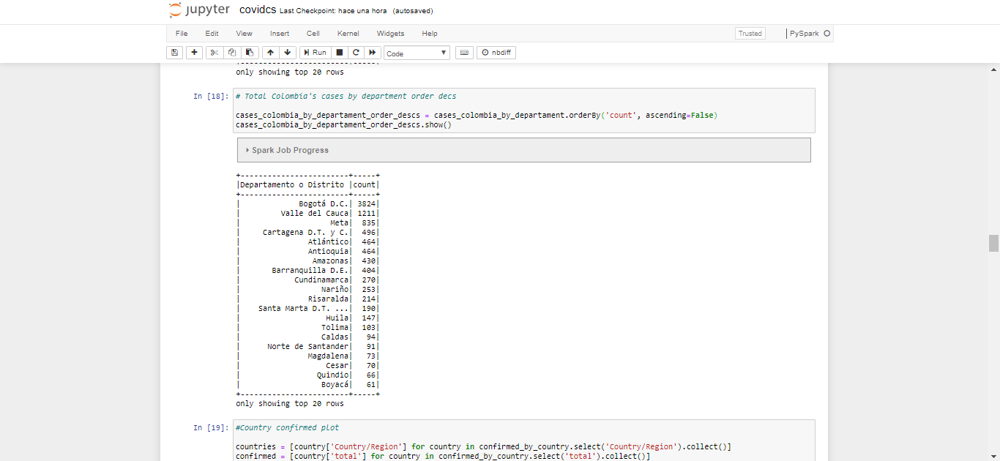

## 5. Visualización Básica de Datos

### 5.1. Situación a Nivel Mundial

#### 5.1.1. Confirmados por País Descendente

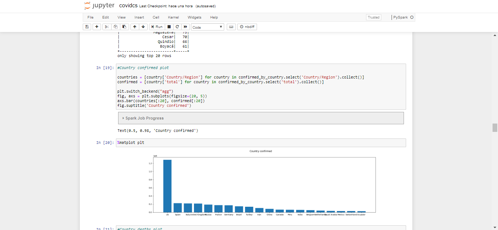

#### 5.1.2. Muertes por País Descendente

#### 5.1.3. Recuperados por País Descendente

#### 5.1.4. Casos Activos Descendente

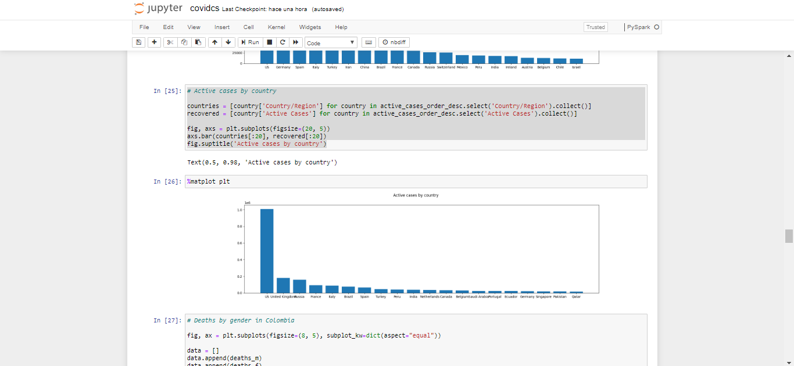

### 5.2. Situación en Colombia

#### 5.2.1. Muertes por Género

 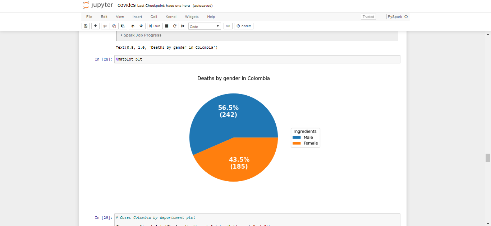

#### 5.2.2. Casos por Departamento

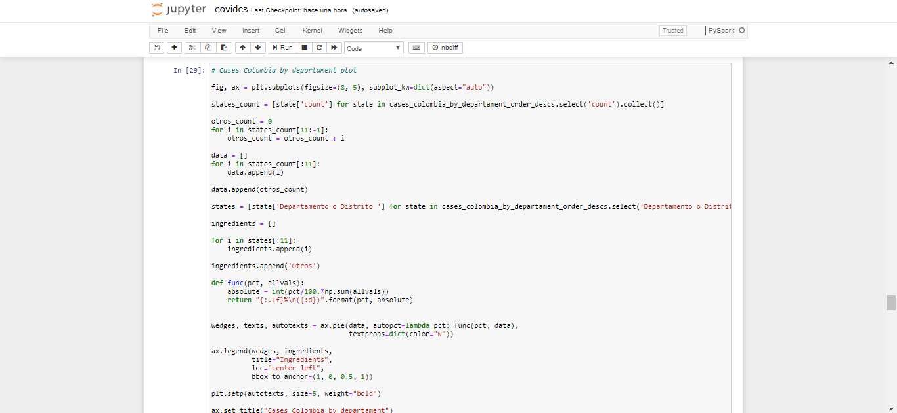 

#### 5.2.3. Muertes por Edad

### 5.3. Colombia vs Mundo

#### 5.3.1. Confirmados

 

#### 5.3.2. Muertes

 

#### 5.3.3. Recuperados

 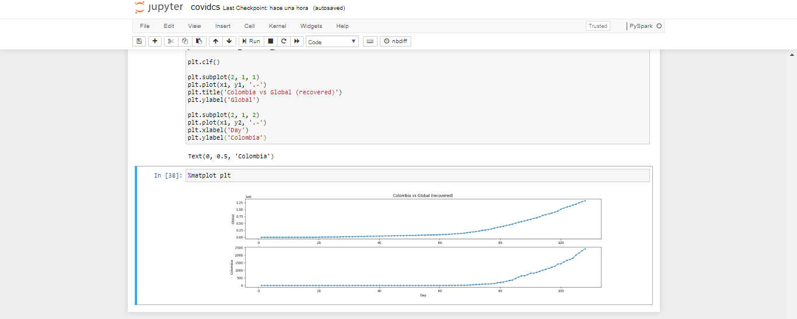
